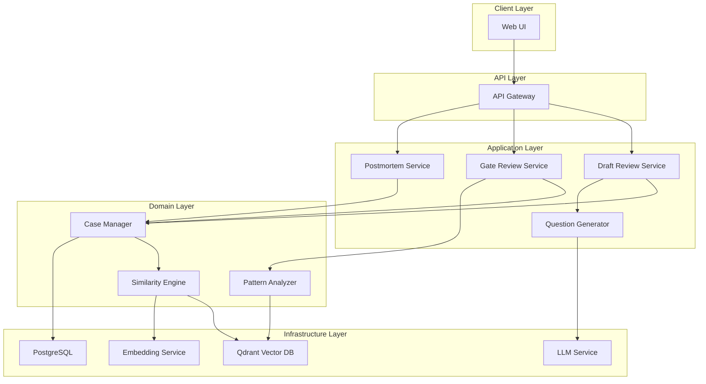
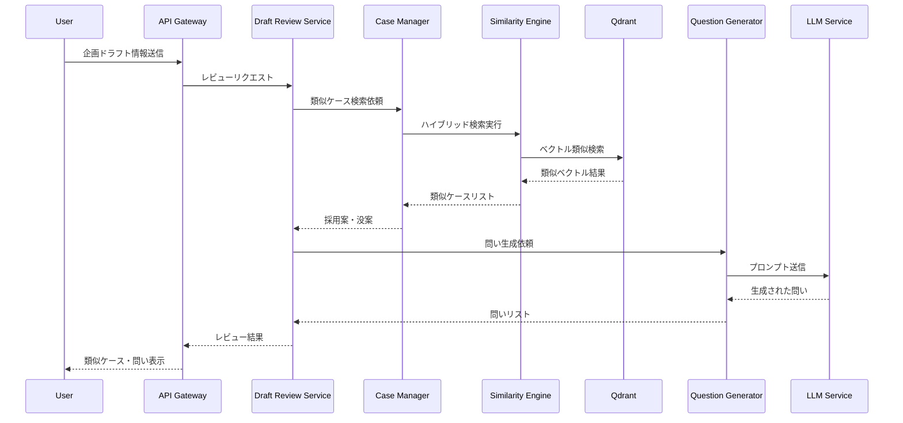
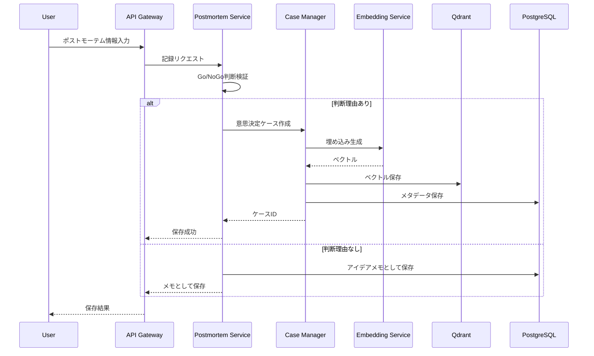
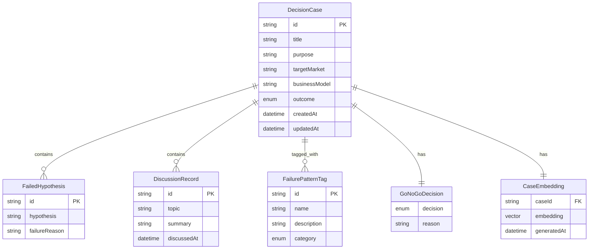

# Design Document: mex-app

## Overview
**Purpose**: 本システムは、過去の意思決定ログ（特に没案）を学習・構造化し、新たな企画に対して「過去の失敗から学ぶための問い」や「類似ケース」を提示する「企画立案OS」を提供する。

**Users**: 新規事業担当者、事業責任者・レビュアー、組織・PMOが、企画立案から意思決定までのワークフローで本システムを活用する。

**Impact**: 組織内の意思決定プロセスを変革し、過去の知見を活用した質の高い意思決定を可能にする。

### Goals
- 企画書ドラフト段階での自己レビュー支援により、事前に欠陥を修正可能にする
- ゲートレビューでの論点整理支援により、本質的な議論に集中可能にする
- 失敗・撤退案件の構造化と資産化により、組織学習を促進する

### Non-Goals
- リアルタイム協調編集機能
- 外部システム（ERP、CRM等）との自動連携
- 自然言語以外のデータ（画像、動画等）の処理
- 完全自動化された意思決定（人間の判断を代替しない）

## Architecture

### Architecture Pattern & Boundary Map



**Architecture Integration**:
- Selected pattern: Layered Architecture with Domain-Driven Design
- Domain/feature boundaries: Application Layer（ユースケース）、Domain Layer（ビジネスロジック）、Infrastructure Layer（外部サービス）
- New components rationale: RAGパイプラインの各段階を明確に分離し、テスト容易性と保守性を確保

### Technology Stack

| Layer | Choice / Version | Role in Feature | Notes |
|-------|------------------|-----------------|-------|
| Frontend | React 18 + TypeScript | SPA形式のWeb UI | 型安全性確保 |
| Backend | Python 3.12 + FastAPI | RESTful API、ビジネスロジック | 非同期処理、型ヒント |
| Vector DB | Qdrant 1.x | 埋め込みベクトル保存・類似検索 | セルフホスト可能 |
| Relational DB | PostgreSQL 16 | 構造化データ保存 | JSONB対応 |
| LLM | OpenAI GPT-4 / Claude | 問い生成、要約 | API経由 |
| Embedding | OpenAI text-embedding-3-large | テキスト埋め込み生成 | 3072次元 |

## System Flows

### 企画ドラフトレビューフロー



### ポストモーテム記録フロー



## Requirements Traceability

| Requirement | Summary | Components | Interfaces | Flows |
|-------------|---------|------------|------------|-------|
| 1.1 | 類似ケース提示 | CaseManager, SimilarityEngine | SimilaritySearchRequest/Response | Draft Review Flow |
| 1.2 | 論点・懸念点要約 | PatternAnalyzer, LLMService | PatternSummaryRequest/Response | Draft Review Flow |
| 1.3 | 問い生成 | QuestionGenerator, LLMService | QuestionGenerationRequest/Response | Draft Review Flow |
| 1.4 | 未検討項目可視化 | DraftReviewService | ReviewProgressState | Draft Review Flow |
| 2.1 | アジェンダ候補出力 | GateReviewService, PatternAnalyzer | AgendaGenerationRequest/Response | Gate Review Flow |
| 2.2 | 採用/不採用理由検索 | CaseManager, SimilarityEngine | DecisionReasonSearchRequest/Response | Gate Review Flow |
| 3.1 | ポストモーテムテンプレート | PostmortemService | PostmortemTemplate | Postmortem Flow |
| 3.2 | 失敗パターンタグ付け | CaseManager | FailurePatternTag | Postmortem Flow |
| 3.3 | ケース/メモ区別 | PostmortemService | CaseValidationResult | Postmortem Flow |

## Components and Interfaces

| Component | Domain/Layer | Intent | Req Coverage | Key Dependencies | Contracts |
|-----------|--------------|--------|--------------|------------------|-----------|
| DraftReviewService | Application | 企画ドラフトレビューオーケストレーション | 1.1, 1.2, 1.3, 1.4 | CaseManager (P0), QuestionGenerator (P0) | Service |
| GateReviewService | Application | ゲートレビュー論点整理 | 2.1, 2.2 | CaseManager (P0), PatternAnalyzer (P1) | Service |
| PostmortemService | Application | ポストモーテム記録管理 | 3.1, 3.2, 3.3 | CaseManager (P0) | Service |
| CaseManager | Domain | 意思決定ケースCRUD・検索 | 1.1, 2.2, 3.2 | SimilarityEngine (P0), PostgreSQL (P0) | Service |
| SimilarityEngine | Domain | ハイブリッド類似検索 | 1.1, 2.2 | Qdrant (P0), EmbeddingService (P0) | Service |
| QuestionGenerator | Domain | LLMベース問い生成 | 1.3 | LLMService (P0) | Service |
| PatternAnalyzer | Domain | 失敗パターン分析・抽出 | 1.2, 2.1, 3.2 | Qdrant (P1), LLMService (P1) | Service |

### Application Layer

#### DraftReviewService

| Field | Detail |
|-------|--------|
| Intent | 企画ドラフトに対する自己レビュー機能を提供 |
| Requirements | 1.1, 1.2, 1.3, 1.4 |

**Responsibilities & Constraints**
- 企画ドラフト情報を受け取り、類似ケース検索と問い生成をオーケストレーション
- ユーザーの回答状況を追跡し、未検討項目を可視化
- トランザクション境界: 読み取り専用操作が中心

**Dependencies**
- Inbound: API Gateway — HTTPリクエスト受信 (P0)
- Outbound: CaseManager — 類似ケース検索 (P0)
- Outbound: QuestionGenerator — 問い生成 (P0)
- Outbound: PatternAnalyzer — 論点要約 (P1)

**Contracts**: Service [x]

##### Service Interface
```typescript
interface DraftReviewService {
  reviewDraft(input: DraftReviewRequest): Promise<Result<DraftReviewResponse, ReviewError>>;
  updateAnswerProgress(input: AnswerProgressUpdate): Promise<Result<ReviewProgress, ValidationError>>;
  getReviewProgress(draftId: string): Promise<Result<ReviewProgress, NotFoundError>>;
}

interface DraftReviewRequest {
  draftId: string;
  purpose: string;
  targetMarket: string;
  businessModel: string;
  additionalContext?: string;
}

interface DraftReviewResponse {
  similarCases: SimilarCase[];
  concernPoints: ConcernPoint[];
  questions: GeneratedQuestion[];
  reviewProgress: ReviewProgress;
}

interface ReviewProgress {
  totalQuestions: number;
  answeredQuestions: number;
  unansweredQuestionIds: string[];
}
```

#### GateReviewService

| Field | Detail |
|-------|--------|
| Intent | ゲートレビュー会議の論点整理を支援 |
| Requirements | 2.1, 2.2 |

**Responsibilities & Constraints**
- 案件フェーズに基づく過去の論点抽出
- 類似案件の採用/不採用理由の検索提供

**Dependencies**
- Inbound: API Gateway — HTTPリクエスト受信 (P0)
- Outbound: CaseManager — 類似ケース検索 (P0)
- Outbound: PatternAnalyzer — 論点抽出 (P0)

**Contracts**: Service [x]

##### Service Interface
```typescript
interface GateReviewService {
  generateAgenda(input: AgendaRequest): Promise<Result<AgendaResponse, ReviewError>>;
  searchDecisionReasons(input: DecisionReasonSearchRequest): Promise<Result<DecisionReason[], SearchError>>;
}

interface AgendaRequest {
  projectId: string;
  currentPhase: ProjectPhase;
  hypothesisStatus: HypothesisStatus[];
}

interface AgendaResponse {
  agendaItems: AgendaItem[];
  relatedCases: SimilarCase[];
  keyDiscussionPoints: DiscussionPoint[];
}
```

#### PostmortemService

| Field | Detail |
|-------|--------|
| Intent | 失敗・撤退案件の構造化記録と資産化 |
| Requirements | 3.1, 3.2, 3.3 |

**Responsibilities & Constraints**
- ポストモーテムテンプレートの提供
- Go/NoGo判断の有無による記録分類
- 失敗パターンのタグ付け支援

**Dependencies**
- Inbound: API Gateway — HTTPリクエスト受信 (P0)
- Outbound: CaseManager — ケース作成・保存 (P0)

**Contracts**: Service [x]

##### Service Interface
```typescript
interface PostmortemService {
  getTemplate(projectId: string): Promise<Result<PostmortemTemplate, NotFoundError>>;
  submitPostmortem(input: PostmortemSubmission): Promise<Result<PostmortemResult, ValidationError>>;
  suggestFailurePatterns(input: PostmortemSubmission): Promise<Result<FailurePatternSuggestion[], AnalysisError>>;
}

interface PostmortemSubmission {
  projectId: string;
  outcome: ProjectOutcome;
  decision: GoNoGoDecision | null;
  decisionReason: string | null;
  failedHypotheses: FailedHypothesis[];
  discussions: DiscussionRecord[];
}

interface PostmortemResult {
  recordType: 'decision_case' | 'idea_memo';
  recordId: string;
  assignedPatterns: FailurePatternTag[];
}

type ProjectOutcome = 'withdrawn' | 'cancelled' | 'pending';

interface GoNoGoDecision {
  decision: 'go' | 'no_go';
  reason: string; // 1-3文
}
```

### Domain Layer

#### CaseManager

| Field | Detail |
|-------|--------|
| Intent | 意思決定ケースのライフサイクル管理 |
| Requirements | 1.1, 2.2, 3.2 |

**Responsibilities & Constraints**
- 意思決定ケースのCRUD操作
- 類似ケース検索のファサード
- 失敗パターンタグの管理

**Dependencies**
- Inbound: Application Services — ケース操作依頼 (P0)
- Outbound: SimilarityEngine — 類似検索実行 (P0)
- Outbound: PostgreSQL — メタデータ永続化 (P0)
- Outbound: EmbeddingService — 埋め込み生成 (P0)

**Contracts**: Service [x]

##### Service Interface
```typescript
interface CaseManager {
  createCase(input: CaseCreateInput): Promise<Result<DecisionCase, ValidationError>>;
  findSimilarCases(input: SimilaritySearchInput): Promise<Result<SimilarCase[], SearchError>>;
  getCaseById(caseId: string): Promise<Result<DecisionCase, NotFoundError>>;
  addFailurePatternTag(caseId: string, tag: FailurePatternTag): Promise<Result<void, ValidationError>>;
}

interface DecisionCase {
  id: string;
  title: string;
  purpose: string;
  targetMarket: string;
  businessModel: string;
  outcome: CaseOutcome;
  decision: GoNoGoDecision;
  failedHypotheses: FailedHypothesis[];
  discussions: DiscussionRecord[];
  failurePatterns: FailurePatternTag[];
  createdAt: Date;
  updatedAt: Date;
}

type CaseOutcome = 'adopted' | 'rejected' | 'withdrawn' | 'cancelled';
```

#### SimilarityEngine

| Field | Detail |
|-------|--------|
| Intent | ハイブリッド類似検索の実行 |
| Requirements | 1.1, 2.2 |

**Responsibilities & Constraints**
- ベクトル検索とBM25テキスト検索のハイブリッド実行
- リランキングによる精度向上
- 検索結果のスコアリングと順位付け

**Dependencies**
- Inbound: CaseManager — 検索依頼 (P0)
- Outbound: Qdrant — ベクトル検索 (P0)
- Outbound: EmbeddingService — クエリ埋め込み生成 (P0)
- Outbound: PostgreSQL — BM25テキスト検索 (P1)

**Contracts**: Service [x]

##### Service Interface
```typescript
interface SimilarityEngine {
  hybridSearch(input: HybridSearchInput): Promise<Result<SimilarityResult[], SearchError>>;
  vectorSearch(input: VectorSearchInput): Promise<Result<SimilarityResult[], SearchError>>;
}

interface HybridSearchInput {
  queryText: string;
  filters?: CaseFilter;
  limit: number;
  vectorWeight: number; // 0.0-1.0
  textWeight: number; // 0.0-1.0
}

interface SimilarityResult {
  caseId: string;
  score: number;
  vectorScore: number;
  textScore: number;
  matchedSegments: string[];
}
```

#### QuestionGenerator

| Field | Detail |
|-------|--------|
| Intent | LLMを活用した問い生成 |
| Requirements | 1.3 |

**Responsibilities & Constraints**
- 類似ケースと失敗パターンに基づく問い生成
- プロンプトエンジニアリングによる質の高い問い生成
- 生成結果のキャッシュ

**Dependencies**
- Inbound: DraftReviewService — 問い生成依頼 (P0)
- Outbound: LLMService — プロンプト実行 (P0)

**Contracts**: Service [x]

##### Service Interface
```typescript
interface QuestionGenerator {
  generateQuestions(input: QuestionGenInput): Promise<Result<GeneratedQuestion[], GenerationError>>;
}

interface QuestionGenInput {
  draftContext: DraftContext;
  similarCases: SimilarCase[];
  failurePatterns: FailurePatternTag[];
  questionCount: number;
}

interface GeneratedQuestion {
  id: string;
  question: string;
  rationale: string;
  relatedCaseIds: string[];
  relatedPatterns: FailurePatternTag[];
  category: QuestionCategory;
}

type QuestionCategory = 'financial' | 'operational' | 'market' | 'technical' | 'organizational';
```

## Data Models

### Domain Model



**Aggregates and Boundaries**:
- DecisionCase: 集約ルート。意思決定ケースの全情報を包含
- FailurePatternTag: 独立エンティティ。複数ケースで共有

**Business Rules & Invariants**:
- DecisionCaseには必ずGoNoGoDecisionが必要（アイデアメモとの区別）
- FailurePatternTagのカテゴリは事前定義されたものに限定

### Logical Data Model

**Structure Definition**:
- DecisionCase: PostgreSQLのJSONBを活用した柔軟なスキーマ
- CaseEmbedding: Qdrantにベクトルとして保存
- FailurePatternTag: マスターテーブルとして正規化

**Indexing Strategy**:
- PostgreSQL: title, purpose, targetMarketに全文検索インデックス
- Qdrant: HNSW（Hierarchical Navigable Small World）インデックス

### Physical Data Model

**PostgreSQL Tables**:
```sql
-- Decision Cases
CREATE TABLE decision_cases (
    id UUID PRIMARY KEY DEFAULT gen_random_uuid(),
    title VARCHAR(255) NOT NULL,
    purpose TEXT NOT NULL,
    target_market VARCHAR(255),
    business_model TEXT,
    outcome VARCHAR(50) NOT NULL,
    decision_type VARCHAR(10) NOT NULL,
    decision_reason TEXT NOT NULL,
    failed_hypotheses JSONB DEFAULT '[]',
    discussions JSONB DEFAULT '[]',
    created_at TIMESTAMP WITH TIME ZONE DEFAULT NOW(),
    updated_at TIMESTAMP WITH TIME ZONE DEFAULT NOW()
);

-- Failure Pattern Tags
CREATE TABLE failure_pattern_tags (
    id UUID PRIMARY KEY DEFAULT gen_random_uuid(),
    name VARCHAR(100) NOT NULL UNIQUE,
    description TEXT,
    category VARCHAR(50) NOT NULL
);

-- Case-Tag Association
CREATE TABLE case_failure_patterns (
    case_id UUID REFERENCES decision_cases(id),
    tag_id UUID REFERENCES failure_pattern_tags(id),
    PRIMARY KEY (case_id, tag_id)
);

-- Idea Memos (non-decision records)
CREATE TABLE idea_memos (
    id UUID PRIMARY KEY DEFAULT gen_random_uuid(),
    project_id VARCHAR(255),
    content JSONB NOT NULL,
    created_at TIMESTAMP WITH TIME ZONE DEFAULT NOW()
);
```

**Qdrant Collection**:
```json
{
  "collection_name": "decision_cases",
  "vectors": {
    "size": 3072,
    "distance": "Cosine"
  },
  "payload_schema": {
    "case_id": "keyword",
    "outcome": "keyword",
    "failure_patterns": "keyword[]"
  }
}
```

## Error Handling

### Error Strategy
- 外部サービス（LLM、Qdrant）障害時はグレースフルデグラデーション
- ユーザー入力エラーは即時フィードバック
- システムエラーは詳細ログと簡潔なユーザーメッセージ

### Error Categories and Responses
**User Errors (4xx)**:
- 400: 入力検証エラー（フィールドレベルのエラー詳細を返却）
- 404: ケースが見つからない（検索条件の見直しを提案）

**System Errors (5xx)**:
- 503: LLMサービス一時不可（キャッシュ結果を返却、または再試行を提案）
- 504: タイムアウト（非同期処理への切り替えを提案）

**Business Logic Errors (422)**:
- Go/NoGo判断なしでケース登録試行（アイデアメモとして保存を提案）

### Monitoring
- 全API呼び出しのレイテンシ・エラー率追跡
- LLM API呼び出しのトークン使用量・コスト追跡
- ベクトル検索のヒット率・精度メトリクス

## Testing Strategy

### Unit Tests
- CaseManager: ケースCRUD操作、バリデーションロジック
- SimilarityEngine: スコア計算、重み付け処理
- QuestionGenerator: プロンプト構築、結果パース
- PostmortemService: Go/NoGo判断検証、記録分類ロジック

### Integration Tests
- API Gateway → Application Services → Domain Services フロー
- PostgreSQL + Qdrant連携（ケース保存→検索）
- LLM API呼び出しと結果処理

### E2E/UI Tests
- 企画ドラフト入力→類似ケース・問い表示フロー
- ポストモーテム入力→ケース/メモ保存フロー
- ゲートレビューアジェンダ生成フロー

### Performance/Load
- 1000件のケースに対する類似検索レスポンスタイム（< 2秒）
- 同時10ユーザーでのドラフトレビューリクエスト処理
- LLM API呼び出しのレート制限対応

## Security Considerations
- API認証: JWT Bearer Token
- データアクセス: 組織単位でのテナント分離
- LLM API Key: 環境変数またはシークレットマネージャーで管理
- 入力サニタイズ: XSS、インジェクション対策

## Performance & Scalability
- ベクトル検索: Qdrantのシャーディングで水平スケール
- LLM呼び出し: セマンティックキャッシュで重複クエリ削減
- 非同期処理: 問い生成の非同期実行オプション
- 目標レスポンスタイム: 類似検索 < 2秒、問い生成 < 10秒
