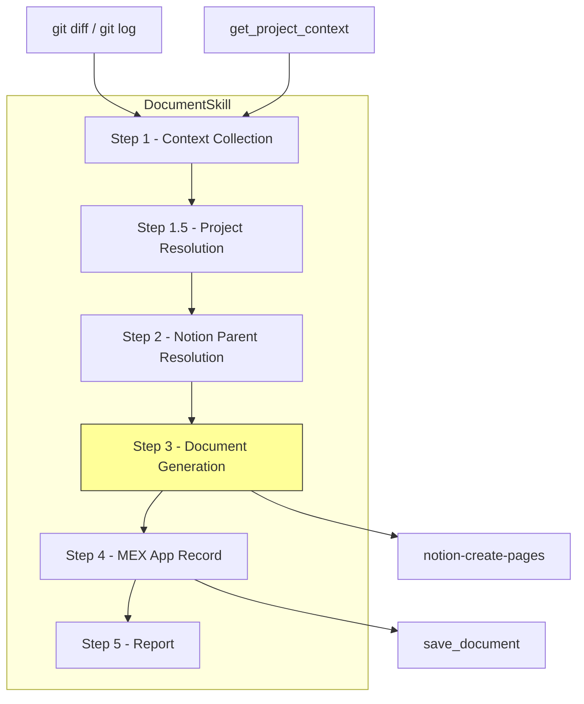
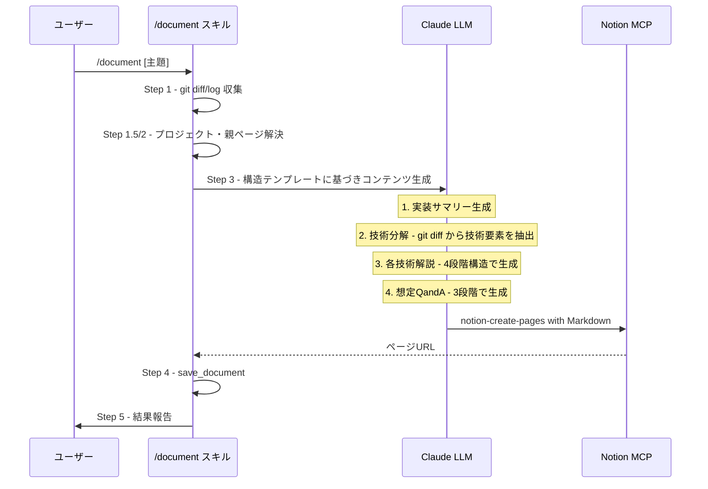

# Design Document: technical-doc-enhancement

## Overview

**Purpose**: AI コーディングツールで実装したコードの技術理解を促進するため、`/document` スキルが生成する Notion ドキュメントの構造を「機能→技術分解→各技術の解説→想定Q&A」の階層構造に変更する。

**Users**: AI を使ってコードを実装するが、使用された技術の基礎概念や設計判断の理由を十分に理解していない開発者。

**Impact**: 既存の `/document` スキル（`.claude/commands/document.md`）の Step 3 ドキュメント構造テンプレートを差し替える。バックエンドAPI・MCPサーバー・フロントエンドへの変更は発生しない。

### Goals
- ドキュメントを読み進めるだけで、機能レベルの理解から技術レベルの理解へ自然に到達できる構造を実現する
- 上司・面接官からの技術的質問に答えられる水準の理解を支援する
- 既存ワークフロー（git収集→プロジェクト解決→Notion作成→MEX App記録）を維持する

### Non-Goals
- バックエンドAPIの変更・拡張
- MCPサーバーへの新ツール追加
- フロントエンドUIの変更
- ドキュメント生成の自動トリガー（手動 `/document` 実行のまま）

## Architecture

### Existing Architecture Analysis

現行の `/document` スキルは以下の5ステップで構成される:

1. **Step 1**: git diff/log + `get_project_context` でコンテキスト収集
2. **Step 1.5**: `.mex.json` またはAPI経由でプロジェクトID解決
3. **Step 2**: Notion親ページの検索・作成
4. **Step 3**: `notion-create-pages` でMarkdownドキュメント作成 ← **変更対象**
5. **Step 4**: `save_document` でMEX App記録

Step 1 で収集される git diff と git log の情報は、新しい技術分解・解説・Q&A生成に十分な入力を提供する。Step 4 の `save_document` パラメータ（title, category, technologies, source_url）は変更不要。

### Architecture Pattern & Boundary Map

**Architecture Integration**:
- 選択パターン: プロンプト駆動のテンプレート変更（`research.md` 参照）
- 変更範囲: `.claude/commands/document.md` の Step 3 内のドキュメント構造定義のみ
- 既存パターン維持: 5ステップのワークフロー、MCP連携、git情報収集すべて既存のまま
- 新コンポーネント: なし（プロンプト内の構造テンプレートのみ差し替え）

### Technology Stack

| Layer | Choice / Version | Role in Feature | Notes |
|-------|------------------|-----------------|-------|
| Skill Definition | Claude Code Custom Command (Markdown) | ドキュメント生成の指示・構造定義 | 変更対象 |
| Notion Integration | `mcp__notion__notion-create-pages` | Markdown→Notionページ変換 | 変更なし |
| MEX MCP | `mcp__mex__save_document` | MEX App へのメタデータ記録 | 変更なし |
| Git | `git diff`, `git log` | 実装コンテキストの収集 | 変更なし |

## System Flows

### ドキュメント生成フロー（Step 3 の内部処理）

## Requirements Traceability

| Requirement | Summary | Components | Interfaces | Flows |
|-------------|---------|------------|------------|-------|
| 1.1, 1.2, 1.3 | 実装サマリー（機能レベル記述） | DocumentTemplate | Step 3 Markdown | ドキュメント生成フロー |
| 2.1, 2.2, 2.3 | 技術分解（技術要素一覧と役割） | DocumentTemplate | Step 3 Markdown | ドキュメント生成フロー |
| 3.1, 3.2, 3.3 | 各技術要素の4段階解説 | DocumentTemplate | Step 3 Markdown | ドキュメント生成フロー |
| 4.1, 4.2, 4.3, 4.4 | 想定Q&A（3段階） | DocumentTemplate | Step 3 Markdown | ドキュメント生成フロー |
| 5.1, 5.2, 5.3, 5.4 | Notion構造統合・既存フロー維持 | DocumentTemplate, Step 4 | notion-create-pages, save_document | ドキュメント生成フロー |
| 6.1, 6.2, 6.3 | 品質担保（具体性・実装紐づけ） | DocumentTemplate | Step 3 Markdown | ドキュメント生成フロー |

## Components and Interfaces

| Component | Domain/Layer | Intent | Req Coverage | Key Dependencies | Contracts |
|-----------|--------------|--------|--------------|-----------------|-----------|
| DocumentTemplate | Skill Definition | Notionドキュメントの構造・内容を定義 | 1〜6 全て | git diff/log (P0), notion-create-pages (P0) | — |

### Skill Definition Layer

#### DocumentTemplate

| Field | Detail |
|-------|--------|
| Intent | `/document` スキルの Step 3 で生成するNotionドキュメントの構造とコンテンツ生成指示を定義する |
| Requirements | 1.1〜1.3, 2.1〜2.3, 3.1〜3.3, 4.1〜4.4, 5.1〜5.4, 6.1〜6.3 |

**Responsibilities & Constraints**
- git diff/log の出力を入力として、4セクション（実装サマリー、技術分解、各技術解説、想定Q&A）を生成するための指示を提供する
- 専門用語を削減せず、文脈から理解できる形で提示する方針を遵守する
- 汎用的なテンプレート説明を排除し、実装コードの具体的な値を引用する品質制約を含む

**Dependencies**
- Inbound: git diff/log 出力 — 実装変更の詳細情報 (P0)
- Inbound: `get_project_context` — プロジェクト技術スタック情報 (P1)
- Outbound: `notion-create-pages` — Markdown→Notionページ変換 (P0)

**Implementation Notes**
- 変更対象ファイル: `.claude/commands/document.md` の Step 3 セクション
- Markdown形式で4セクション構造を定義（H2/H3 による階層化）
- 品質制約: 「git diff から引用する」「汎用説明のみ不可」をプロンプトに明記
- 技術解説の深さ調整: 「コア技術は詳細に、補助的な技術は簡潔に」の指示を含む

## Data Models

本機能はプロンプト（スキル定義ファイル）の変更のみのため、データモデルの変更はない。既存の `save_document` パラメータ構造を維持する:

- `title`: string — 短い要約（20文字程度）
- `category`: enum — tutorial / design / debug_guide / learning / reference
- `technologies`: string[] — 使用技術リスト（3〜5個）
- `source_url`: string — NotionページURL

## Error Handling

### Error Strategy
既存の `/document` スキルのエラーハンドリング（Step のエラーハンドリングセクション）をそのまま維持する。新構造固有のエラーは発生しない。

### 生成品質に関する注意事項
- **技術要素が特定できない場合**: git diff が空またはコンフィグ変更のみの場合、技術分解セクションを「設定変更のため技術分解は省略」として簡略化する
- **Q&A生成が困難な場合**: 非常に小さな変更（typo修正等）の場合、Q&Aセクションを省略し、サマリーのみのドキュメントを生成する

## Testing Strategy

### 手動検証
本機能はプロンプト変更のため、自動テストではなく手動検証で品質を確認する:

1. **構造検証**: 生成されたNotionページが4セクション構造（実装サマリー、技術分解、各技術解説、想定Q&A）を含むこと
2. **具体性検証**: 技術解説にgit diffからの具体的な値（ライブラリ名、設定値、関数名）が引用されていること
3. **Q&A品質検証**: 質問が基礎→判断→応用の3段階で構成され、合計6問以上あること
4. **既存フロー検証**: MEX App への記録が正常に完了し、source_url にNotionページURLが設定されていること
5. **エッジケース検証**: 小さな変更（typo修正等）でも破綻しないこと

### 検証シナリオ
- 認証機能の実装（複数技術要素: JWT, bcrypt, ミドルウェア）
- 単純なUI修正（技術要素が少ないケース）
- バグ修正（debug_guide カテゴリ）
- 新ライブラリ導入（learning カテゴリ）
