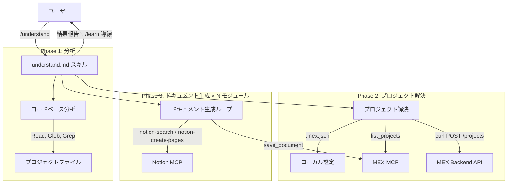
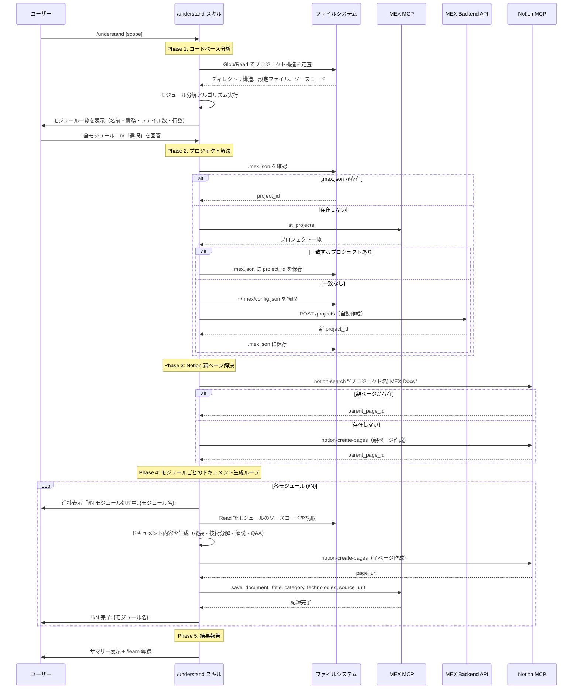

# Design Document: `/understand` スキル

## 1. 概要

### 目的
既存コードベースをモジュール/機能単位で分析し、各モジュールの技術ドキュメントを Notion に自動生成して MEX App に開発ログとして記録するスキル。`/document` の「差分ベース」に対し、「既存コードベース全体」を分析対象とする。

### ユーザー
- AI コーディングツールでアプリを構築した開発者
- 既存プロジェクトに途中参加した開発者
- MEX を途中導入し、過去分のドキュメントがないユーザー

### ゴール
1. コードベースを自動的にモジュール単位に分解し、ユーザーが理解する単位を提示する
2. 各モジュールについて `/document` と同等品質の技術ドキュメントを Notion に生成する
3. 生成ドキュメントを MEX App に記録し、`/learn` パイプラインに接続する
4. バックエンド変更なし（既存 MCP ツールのみ使用）でスキルを実現する

### 非ゴール
- コードベースのリファクタリング提案
- テストカバレッジの分析
- セキュリティ脆弱性の検出
- git 履歴の遡及分析（将来の拡張候補）
- コードの自動修正や改善提案

---

## 2. アーキテクチャ

### 2.1 アーキテクチャ概要



**アーキテクチャ方針**: スキルファイル（`.claude/skills/understand.md`）のみで実装する。バックエンド変更なし。既存の MCP ツール（MEX MCP, Notion MCP）を組み合わせて機能を実現する。

### 2.2 技術スタック

| レイヤー | 選択 | 役割 |
|---------|------|------|
| スキル定義 | `.claude/skills/understand.md` | 実行手順・プロンプト定義 |
| コードベース分析 | Glob, Read, Grep ツール | ファイル走査・構造分析 |
| Notion連携 | `mcp__notion__notion-search`, `mcp__notion__notion-create-pages` | ドキュメント作成 |
| MEX記録 | `mcp__mex__save_document`, `mcp__mex__list_projects`, `mcp__mex__get_project_context` | 開発ログ記録 |
| プロジェクト作成 | Bash (`curl`) | 新規プロジェクト API 呼び出し |
| ローカル設定 | Read, Write (`~/.mex/config.json`, `.mex.json`) | 認証・プロジェクトID 管理 |

---

## 3. システムフロー

### 3.1 メインフロー



---

## 4. 要件トレーサビリティ

| 要件ID | 要件概要 | 実現するコンポーネント | 主要フロー |
|--------|---------|---------------------|-----------|
| Req 1 | コードベースのモジュール分解 | コードベース分析（Phase 1） | メインフロー Phase 1 |
| Req 2 | モジュール単位の技術ドキュメント生成 | ドキュメント生成ループ（Phase 4） | メインフロー Phase 4 |
| Req 3 | Notion への一括ドキュメント作成 | Notion MCP 連携（Phase 3-4） | メインフロー Phase 3-4 |
| Req 4 | MEX App への一括記録 | MEX MCP 連携（Phase 4） | メインフロー Phase 4 |
| Req 5 | プロジェクト解決とセットアップ | プロジェクト解決（Phase 2） | メインフロー Phase 2 |
| Req 6 | `/learn` との連携 | 結果報告（Phase 5） | メインフロー Phase 5 |
| Req 7 | 実行進捗の可視化 | ループ内進捗表示（Phase 4） | メインフロー Phase 4 |

---

## 5. コンポーネント詳細

### 5.1 コードベース分析エンジン

| フィールド | 詳細 |
|-----------|------|
| **意図** | プロジェクトのソースコードを走査し、意味のある機能単位にモジュール分解する |
| **要件カバレッジ** | Req 1 |
| **使用ツール** | Glob, Read, Grep |

**モジュール検出ヒューリスティック:**

```
1. プロジェクトタイプ判定
   - package.json → Node.js/React プロジェクト
   - requirements.txt / pyproject.toml → Python プロジェクト
   - 両方 → モノレポ（フロントエンド + バックエンド）

2. トップレベル構造からモジュール候補を検出
   - frontend/src/components/{Name}/ → コンポーネントモジュール
   - frontend/src/api/ → API クライアントモジュール
   - frontend/src/contexts/ → 状態管理モジュール
   - backend/app/api/ → API エンドポイントモジュール
   - backend/app/application/ → ビジネスロジックモジュール
   - backend/app/domain/ → ドメインロジックモジュール
   - backend/app/infrastructure/ → インフラモジュール
   - mcp-server/src/ → MCP サーバーモジュール

3. モジュールのグルーピング
   - 関連するディレクトリを機能単位でグルーピング
   - 例: backend/app/api/auth.py + backend/app/auth/ → 「認証システム」
   - 例: frontend/src/components/Auth/ + frontend/src/api/auth.ts → 「認証UI」

4. 各モジュールの情報収集
   - 主要ファイル一覧
   - 推定行数（wc -l 相当）
   - import/require 文から依存関係を推定
   - 使用技術（ライブラリ/フレームワーク）を検出
```

**スコープ指定のパターン:**

| 引数 | 動作 |
|------|------|
| なし | 全プロジェクト分析 → モジュール一覧提示 |
| `backend` | backend/ ディレクトリのみ分析 |
| `認証` or `auth` | 認証関連モジュールのみ分析 |
| `backend/app/api/` | 指定ディレクトリのみ分析 |

### 5.2 ドキュメント生成エンジン

| フィールド | 詳細 |
|-----------|------|
| **意図** | 各モジュールのソースコードを読み解き、`/document` と統一されたフォーマットで技術ドキュメントを生成する |
| **要件カバレッジ** | Req 2, Req 3 |
| **使用ツール** | Read（ソースコード読取）, Notion MCP（ページ作成） |

**ドキュメント構造（`/document` と統一）:**

```markdown
## モジュール概要

**モジュール名**: {モジュール名}
**責務**: {このモジュールが担う機能を1〜2文で}
**全体における位置づけ**: {アプリ全体のどの部分を担当しているか}
**依存関係**: {他モジュールとの関係}

**構成ファイル**:
- `path/to/file1.ts` — {ファイルの役割}
- `path/to/file2.ts` — {ファイルの役割}

## 技術分解

このモジュールを構成する技術要素:

- **{技術要素名}** — {役割の説明}
- **{技術要素名}** — {役割の説明}

## 各技術要素の解説

### {技術要素名}

**それは何か**
{定義と概要。コードの具体的な使用箇所を引用}

**なぜ必要か**
{このモジュールにおける必要性。具体的な設定値・関数名を引用}

**他の選択肢**
{代替技術と選ばなかった理由}

**壊れたらどうなるか**
{欠落時の具体的な影響}

## 想定Q&A

### 基礎（「そもそも何？」レベル）
**Q: ...**
A: **結論**: ... **理由**: ... **具体例**: ...

### 判断（設計・技術選定の理由）
**Q: ...**
A: **結論**: ... **理由**: ... **具体例**: ...

### 応用（エッジケース・障害・スケール対応）
**Q: ...**
A: **結論**: ... **理由**: ... **具体例**: ...
```

**`/document` との差分:**

| 項目 | `/document` | `/understand` |
|------|-----------|-------------|
| 冒頭セクション | 実装サマリー（ユーザーの指示 + 変更規模） | モジュール概要（責務 + 位置づけ + 依存関係 + ファイル一覧） |
| 技術分解の根拠 | git diff のコード変更 | モジュール全体のソースコード |
| Q&A の文脈 | 「なぜこの変更をしたか」 | 「なぜこの技術構成になっているか」 |
| Notion タイトル | `{短い要約}` | `[Understand] {モジュール名}` |

### 5.3 MEX 記録パラメータ

`save_document` への渡し方:

| パラメータ | 値 | 根拠 |
|-----------|-----|------|
| `project_id` | Phase 2 で解決した ID | `/document` と同じ |
| `title` | モジュール名の短い要約 | 20文字程度 |
| `category` | `learning` | 既存コードの理解 = 学習コンテンツ |
| `technologies` | モジュールで使用されている主要技術 | 3〜5個 |
| `source_url` | Notion ページ URL | `/learn` 連携のため必須 |

---

## 6. エラーハンドリング

| エラー | 対応 | ユーザーへの案内 |
|--------|------|---------------|
| Notion MCP 接続エラー | スキル中断 | 「Notion MCP の設定を確認してください」 |
| MEX MCP 接続エラー | Notion 作成は続行、MEX 記録をスキップ | 「Notion ページは作成済みです。MEX MCP を再起動後、手動で記録してください」 |
| 特定モジュールの分析失敗 | そのモジュールをスキップ、次へ | 最終報告で失敗モジュールを一覧表示 |
| Notion API レート制限 | 待機後リトライ（最大3回） | 「Notion API の制限に達しました。しばらく待ってから再実行してください」 |
| プロジェクト作成 API エラー | スキル中断 | 「`~/.mex/config.json` とバックエンドの起動状態を確認してください」 |
| ソースコードが読めない（バイナリ等） | そのファイルをスキップ | スキップしたファイルを報告 |

---

## 7. テスト戦略

### 手動テスト（スキルファイルのため自動テスト困難）

| テストケース | 手順 | 期待結果 |
|------------|------|---------|
| 全プロジェクト分析 | MEX App プロジェクトで `/understand` 実行 | モジュール一覧が表示される |
| スコープ指定 | `/understand backend` で実行 | backend のモジュールのみ分析 |
| Notion ドキュメント確認 | 生成された Notion ページを開く | 4セクション構造が正しい |
| MEX 記録確認 | ダッシュボードで開発ログを確認 | 各モジュールが個別エントリとして記録 |
| `/learn` 連携 | `/understand` 後に `/learn` を実行 | 生成ドキュメントが source として検出される |
| 初回実行（プロジェクト未登録） | `.mex.json` がないプロジェクトで実行 | プロジェクト自動作成 + `.mex.json` 保存 |
| エラー耐性 | Notion MCP を停止して実行 | エラーメッセージが表示される |

---

## 8. 成果物

| ファイル | 種類 | 説明 |
|---------|------|------|
| `.claude/skills/understand.md` | 新規作成 | `/understand` スキル定義ファイル |

**バックエンド変更: なし**
**フロントエンド変更: なし**
**MCP サーバー変更: なし**

既存の `save_document` MCP ツールの `category` フィールドは自由文字列のため、`learning` を指定するだけで対応可能。DevLogEntry の `metadata_` は任意 JSON のため、モジュール情報の付加も既存スキーマ内で完結する。
